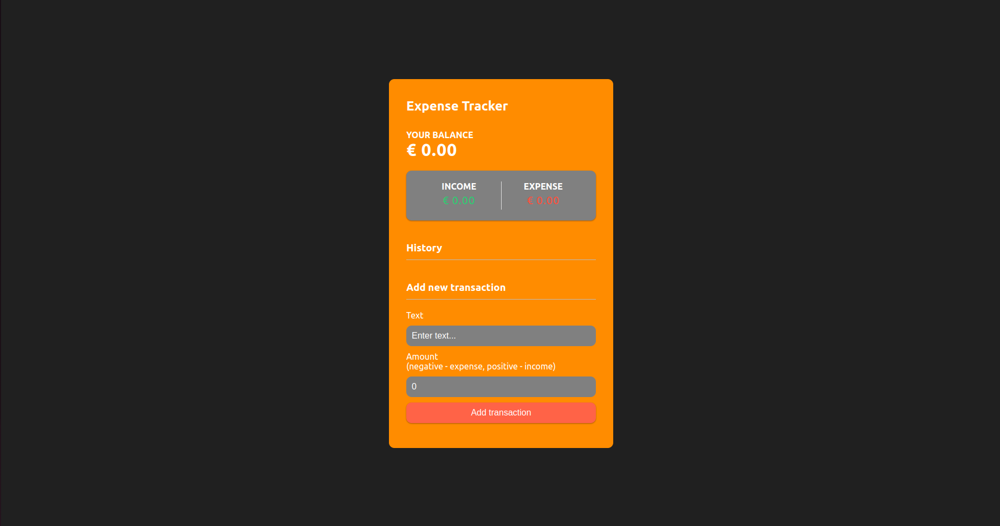

# Expense Tracker

**[Test this app yourself](https://my-new-expense-tracker-react.vercel.app/)**

---

### About Project

This Appe can help you track your expenses keeping an eye on what you earn and what you spend,

### How to use this Project

Here you can use the text field to say what you have spent monay for or earn money from, and keep your finances in check.

##### Developed With

- [x] _HTML5_
- [x] _CSS3_
- [ ] _SASS_
- [ ] _SCSS_
- [x] _JavaScript_
- [x] _React_
- [ ] _Bootstrap_
- [x] _npm_
- [ ] _..._

---

### Contact

Mail: <penninoematita@gmail.com> 
GitHub: [vincenzoarena](https://github.com/vincenzoarena) 
LinkedIn: [Vincenzo Arena](https://www.linkedin.com/in/vincenzo-arena-032a064b/)

---

### Used Tools

- [npm](https://www.npmjs.com/)
- [Google Fonts](https://fonts.google.com/)
- [Visual Studio Code](https://code.visualstudio.com/)

---
